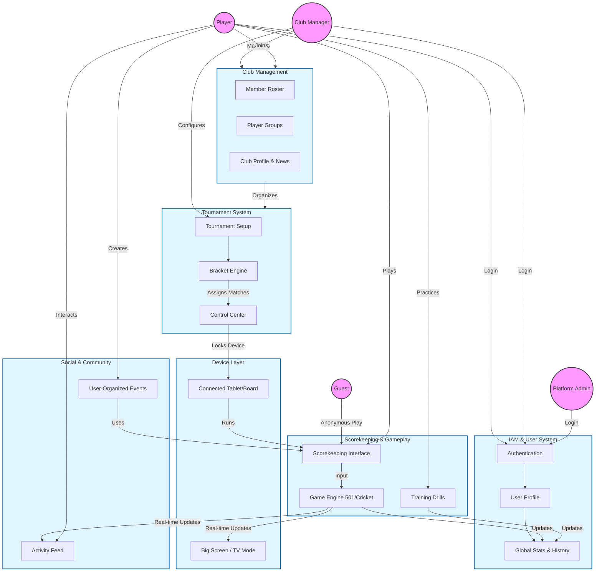

# Pikado Functional Architecture

This chart visualizes the interactions between the core functional modules of Pikado based on the documentation in `docs/functional`.

## Module Breakdown

### 1. IAM & Users
*   **Guests** can play immediately but don't save stats.
*   **Players** have profiles, stats, and history.
*   **Managers** run clubs and tournaments.

### 2. Club Management
*   Managers control rosters and groups.
*   Groups are used to quickly populate tournaments.

### 3. Tournaments
*   The **Control Center** is the brain.
*   It pushes match assignments to **Connected Tablets**, locking them into "Tournament Mode".

### 4. Gameplay (Scorekeeping)
*   The core engine supports 501, Cricket, and Training.
*   It feeds data to **Global Stats** and **Live Scoring** (Big Screen).

### 5. Social
*   Players can organize their own "Community Events" outside of clubs.
*   Activity Feed broadcasts achievements (e.g., "180!").
